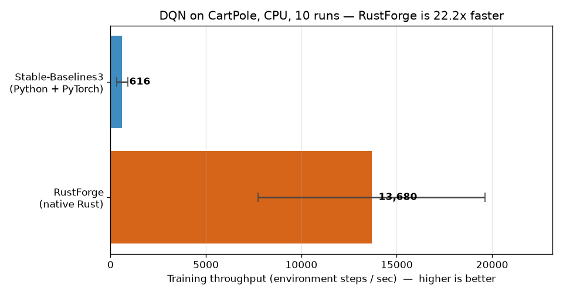
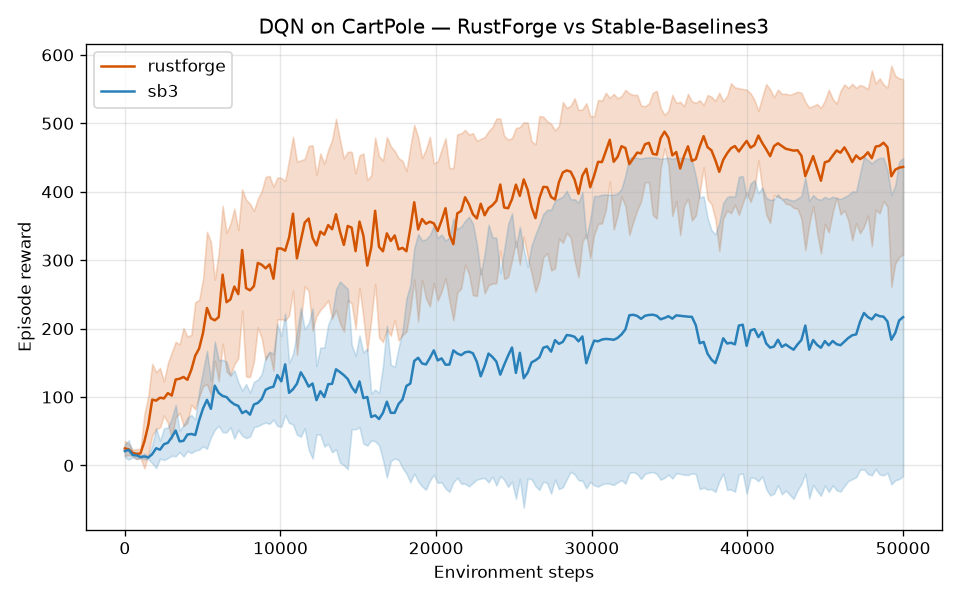

<p align="center">
  <h1 align="center">🔥 RustForge RL</h1>
  <p align="center">
    <strong>A high-performance Reinforcement Learning framework built from the ground up in Rust.</strong>
  </p>
  <p align="center">
    <a href="#features">Features</a> •
    <a href="#architecture">Architecture</a> •
    <a href="#quick-start">Quick Start</a> •
    <a href="#roadmap">Roadmap</a> •
    <a href="#contributing">Contributing</a>
  </p>
</p>

<p align="center">
  
  
  
  <a href="https://github.com/tjunjie1408/RustForge-RL/actions/workflows/ci.yml"></a>
  <a href="https://pypi.org/project/rustforge-rl/"></a>
</p>

---

## Why RustForge RL?

The Reinforcement Learning ecosystem is dominated by Python frameworks (Stable-Baselines3, RLlib, CleanRL), which are powerful but carry inherent limitations:

| Pain Point | Python Frameworks | RustForge RL |
|---|---|---|
| **Runtime Speed** | GIL bottleneck, interpreter overhead | Zero-cost abstractions, native speed |
| **Memory Safety** | Runtime errors, memory leaks | Compile-time guarantees via ownership |
| **Concurrency** | Fragile multiprocessing | Fearless concurrency with `Send`/`Sync` |
| **Deployment** | Heavy runtimes, dependency hell | Single static binary, no runtime |
| **Reproducibility** | Floating-point non-determinism | Deterministic seeding at every layer |

RustForge RL aims to be the **first comprehensive, production-grade RL framework in Rust** — not just a toy implementation, but a framework you can use to train real agents and deploy them anywhere.

---

## Features

### 🧮 Tensor Engine (`rustforge-tensor`) — ✅ Complete

A PyTorch-style tensor library built on top of [`ndarray`](https://github.com/rust-ndarray/ndarray):

- **Creation**: `from_vec`, `zeros`, `ones`, `eye`, `arange`, `linspace`, `scalar`, `full`
- **Shape Transforms**: `reshape`, `flatten`, `transpose`, `permute`, `unsqueeze`, `squeeze`
- **Arithmetic**: Overloaded `+`, `-`, `*`, `/` with full broadcasting support
- **Matrix Math**: `matmul` supporting dot products, matrix-vector, and batch matrix multiplication
- **Reductions**: `sum`, `mean`, `max`, `argmax`, `var`, `std_dev` (with axis + keepdim support)
- **Activations**: `relu`, `sigmoid`, `tanh`, `softmax`, `log_softmax` (numerically stable)
- **Math Ops**: `exp`, `log`, `pow`, `sqrt`, `abs`, `clamp`, `neg`, `reciprocal`
- **Concatenation**: `cat` and `stack` with arbitrary axis support
- **Random Init**: Uniform, Normal, Xavier/Glorot, Kaiming/He initialization strategies
- **Display**: PyTorch-style pretty printing with automatic truncation for large tensors

### 🔄 Autograd Engine (`rustforge-autograd`) — ✅ Complete

- `Variable` wrapper with gradient tracking (`Rc<RefCell<>>`)
- Dynamic computational graph construction via `GradFn` trait
- Backward pass via topological sort + chain rule
- 17 gradient mappings for operations and math functions
- Numerical gradient checking (finite difference method)
- Optimizers: SGD (w/ momentum), Adam (bias-corrected)

### 🧠 Neural Network Modules (`rustforge-nn`) — ✅ Complete

- `Linear`, `Conv2d`, `BatchNorm`, `LayerNorm`
- `Sequential` container, `Module` trait
- Loss functions: MSE, CrossEntropy, Huber
- Model parameter serialization and load/save support

### 🎮 RL Algorithms (`rustforge-rl`) — ✅ Phase 4 Complete

- **Value-Based**: DQN and Double DQN with target networks
- **Policy Gradient**: REINFORCE, A2C, PPO Discrete, PPO Continuous
- **Off-Policy Continuous Control**: TD3 and SAC with target critics and soft updates
- **Continuous Policies**: Tanh-squashed Gaussian policy with action scaling and log-prob correction
- **Environment Interface**: Gymnasium-compatible traits, zero-cost wrappers, vectorized environments (`SyncVectorEnv`)
- **Built-in Environments**: CartPole, GridWorld, MountainCar (discrete), MountainCarContinuous, Pendulum
- **Buffers**: Uniform replay, on-policy rollout, continuous replay, continuous rollout

### 🐍 Python Bindings (`rustforge-python`) — ✅ Complete

- **PyO3 0.25** native extension module, built with [`maturin`](https://www.maturin.rs/)
- **Native environments** exposed to Python: CartPole, GridWorld, MountainCar, MountainCarContinuous, Pendulum
- **DQN agent**: `DQN.train(...)` natively, then `predict(obs)` from Python
- **Gymnasium bridge**: `rustforge.make("CartPole")` returns a `gymnasium.Env` whose `reset`/`step` yield `float32` NumPy observations
- **Typed**: ships `_core.pyi` type stubs + a `py.typed` marker; covered by a dedicated CI job
- **Wheels**: one abi3 wheel per platform (CPython ≥ 3.9) for Linux x86_64/aarch64, macOS universal2, and Windows x86_64

### 📊 Native terminal training console — ✅ Complete

- Ratatui overview, charts, run details, and reliable event/activity views
- `rustforge monitor <metrics.csv>` for completed or growing RustForge DQN CSV v1 files and Stable-Baselines3 `monitor.csv` / `progress.csv` logs (format detected from the header)
- `rustforge run dqn` for in-process metrics plus pause/resume and graceful/force stop
- Independent CSV persistence and collision-safe run manifests
- ASCII and no-color accessibility modes
- GPU DQN can save and resume agent/optimizer state with `--device gpu --checkpoint <file>` / `--resume <file>`; replay, exploration and environment state restart

---

## Architecture

RustForge RL is organized as a **Cargo workspace** with strict, one-directional dependencies:

```
rustforge-rl/
├── Cargo.toml                 # Workspace root
├── crates/
│   ├── rustforge-tensor/      # 🧮 Tensor computation engine
│   │   └── src/
│   │       ├── lib.rs         # Crate entry point & re-exports
│   │       ├── tensor.rs      # Core Tensor struct + operations
│   │       ├── ops.rs         # Operator overloading (+, -, *, /, matmul)
│   │       ├── shape.rs       # Broadcasting rules & shape utilities
│   │       ├── random.rs      # Random initialization strategies
│   │       ├── display.rs     # Pretty-print formatting
│   │       └── error.rs       # Type-safe error definitions
│   │
│   ├── rustforge-autograd/    # 🔄 Automatic differentiation
│   ├── rustforge-nn/          # 🧠 Neural network layers
│   ├── rustforge-rl/          # 🎮 RL algorithms
│   │   └── src/
│   │       └── env/           # 🌍 Zero-cost Gymnasium environments & wrappers
│   ├── rustforge-cli/         # ⌨️  Command-line training tool
│   └── rustforge-python/      # 🐍 PyO3 Python bindings (built with maturin)
│       ├── src/               # Rust: env.rs, agent.rs, space.rs, lib.rs
│       └── python/rustforge/  # Python package + Gymnasium bridge (gym.py)
│
├── examples/                  # Runnable examples (coming soon)
└── benches/                   # Performance benchmarks (coming soon)
```

**Dependency graph:**

```
tensor ← autograd ← nn ← rl
                          ↓
                     cli, python bindings
                     dashboard (planned)
```

Each layer only depends on the layer below it, ensuring clean separation of concerns and independent testability.

---

## Quick Start

### Prerequisites

- [Rust](https://rustup.rs/) 1.75+ (2021 edition)
- A C compiler (for `ndarray`'s BLAS backend — MSVC on Windows, GCC/Clang on Linux/macOS)

### Build & Test

```bash
# Clone the repository
git clone https://github.com/tjunjie1408/RustForge-RL.git
cd RustForge-RL

# Build the entire workspace
cargo build

# Run the full workspace test suite
cargo test --workspace

# Run with optimizations for benchmarking
cargo build --release
```

### Basic Usage

```rust
use rustforge_tensor::Tensor;

fn main() {
    // Create tensors
    let weights = Tensor::xavier_uniform(&[128, 64], Some(42));
    let input = Tensor::rand_normal(&[32, 64], 0.0, 1.0, None);
    let bias = Tensor::zeros(&[128]);

    // Forward pass: output = input @ weights^T + bias
    let output = input.matmul(&weights.t()) + bias;

    // Activation
    let activated = output.relu();

    // Softmax for probability distribution
    let probs = activated.softmax(1).unwrap();

    println!("Output shape: {:?}", probs.shape());
    println!("Probabilities:\n{}", probs);
}
```

### Tensor Operations Examples

```rust
use rustforge_tensor::Tensor;

// Broadcasting: [3, 1] + [1, 4] → [3, 4]
let a = Tensor::from_vec(vec![1.0, 2.0, 3.0], &[3, 1]);
let b = Tensor::from_vec(vec![10.0, 20.0, 30.0, 40.0], &[1, 4]);
let c = &a + &b;  // shape: [3, 4]

// Reductions
let data = Tensor::rand_uniform(&[100, 50], 0.0, 1.0, Some(0));
println!("Mean: {:.4}", data.mean().item());
println!("Std:  {:.4}", data.std_dev().item());

// Matrix multiplication
let q = Tensor::randn(&[8, 64], Some(1));  // queries
let k = Tensor::randn(&[8, 64], Some(2));  // keys
let attention = q.matmul(&k.t());           // [8, 8] attention scores
let weights = (& attention / 8.0_f32.sqrt()).softmax(1).unwrap();
```

### Python (via PyO3 bindings)

Install the published package (import name `rustforge`):

```bash
pip install rustforge-rl            # native environments + DQN
pip install "rustforge-rl[gym]"     # plus the Gymnasium bridge
```

Or build from source for development:

```bash
cd crates/rustforge-python
python -m venv .venv
# Windows: .venv\Scripts\Activate.ps1   |   Unix: source .venv/bin/activate
pip install "maturin>=1.9,<2.0" pytest "gymnasium>=0.29" "numpy>=1.21"
maturin develop
```

```python
import rustforge

# Gymnasium-style env (reset/step return float32 NumPy observations)
env = rustforge.make("CartPole")
obs, info = env.reset(seed=0)
obs, reward, terminated, truncated, info = env.step(env.action_space.sample())

# Train a DQN natively, then act from Python
agent = rustforge.DQN.train("cartpole", episodes=200)
action = agent.predict([float(x) for x in obs])
```

### Watch Stable-Baselines3 training in the terminal

`rustforge monitor` follows SB3 logs as they are written, with no code changes
beyond the logging SB3 already supports. Download the `rustforge` binary for
your platform from the [latest release](https://github.com/tjunjie1408/RustForge-RL/releases/latest),
or build it with `cargo install --git https://github.com/tjunjie1408/RustForge-RL rustforge-cli`.

```python
import gymnasium as gym
from stable_baselines3 import PPO
from stable_baselines3.common.logger import configure
from stable_baselines3.common.monitor import Monitor

env = Monitor(gym.make("CartPole-v1"), "logs/monitor.csv")  # one row per episode
model = PPO("MlpPolicy", env)
model.set_logger(configure("logs", ["stdout", "csv"]))       # logs/progress.csv
model.learn(100_000)
```

```bash
rustforge monitor logs/monitor.csv    # every episode's reward
rustforge monitor logs/progress.csv   # rolling mean reward, loss, exploration/entropy
```

---

## Roadmap

| Phase | Milestone | Status |
|-------|-----------|--------|
| **Phase 1** | Tensor Engine | ✅ Complete (51 tests passing) |
| **Phase 1** | Autograd Engine | ✅ Complete (49 tests passing) |
| **Phase 2** | Neural Network Modules | ✅ Complete (74 tests passing) |
| **Phase 2** | Optimizers (SGD, Adam) | ✅ Complete |
| **Phase 3** | Environment Infra & Vectorization | ✅ Complete |
| **Phase 3** | DQN + CartPole | ✅ Complete |
| **Phase 3** | REINFORCE + A2C | ✅ Complete |
| **Phase 4** | PPO + Continuous Control | ✅ Complete |
| **Phase 4** | SAC + TD3 | ✅ Complete |
| **Phase 5** | Python Bindings (PyO3) | ✅ Complete |
| **Phase 5** | Terminal Training Console (`rustforge run` / `monitor`) | ✅ Complete |
| **Phase 5** | Benchmarks vs SB3 | ✅ Complete (DQN/CartPole; ~22× faster) |
| **Phase 5** | GPU Support (wgpu) | 🚧 Device tensors, autograd, neural-network modules and GPU DQN/Double DQN and checkpoint/resume, CLI/runtime device selection, prioritized replay and discrete PPO rollout/GAE training with CLI/runtime and checkpoints implemented; continuous Gaussian/PPO objectives, seeded continuous rollout/GAE agent training and Pendulum CLI/runtime/checkpoints implemented; GPU A2C objectives implemented; GPU A2C rollout/GAE agent training implemented; A2C CartPole runtime/CLI and checkpoints implemented; REINFORCE objective foundation implemented; REINFORCE rollout training next, hardware validation pending |

### GPU development

The optional `rustforge-tensor/gpu` feature provides a reusable
`rustforge_tensor::gpu::GpuContext` and explicit `f32` matrix multiplication:

```bash
cargo run --locked -p rustforge-tensor --features gpu --example gpu_matmul
cargo test --locked -p rustforge-tensor --features gpu --test gpu_matmul -- --include-ignored
```

A working compute adapter and graphics driver are required; Mesa software
adapters can run these commands on machines without a physical GPU. These
adapter-required tests are ignored in ordinary test runs and exercised
explicitly by the dedicated GPU CI job. Missing adapters fail the explicit
test run rather than silently skipping it.

The backend supports persistent `GpuTensor` storage: upload inputs once, chain
products on the device, and download only when CPU data is needed.
`GpuContext::matmul_into` reuses an existing output buffer; cloned contexts
share a device, and tensors from unrelated devices are rejected.

```rust
use rustforge_tensor::{gpu::GpuContext, Tensor};

let context = GpuContext::new()?;
let input = context.upload(&Tensor::ones(&[2, 3]))?;
let weights = context.upload(&Tensor::ones(&[3, 2]))?;
let projection = context.upload(&Tensor::eye(2))?;
let hidden = context.matmul_device(&input, &weights)?;
let mut output = context.zeros(&[2, 2])?;
context.matmul_into(&hidden, &projection, &mut output)?;
let result = context.download(&output)?;
```

Transfers support scalars and arbitrary tensor ranks. Matrix multiplication
supports rank-two rectangular operands, 8×8 tiled workgroup caching, and
`matmul_t` / `t_matmul` without transposed copies. Device-only addition,
multiplication, ReLU, full sum and mean can feed subsequent device operations.
Binary elementwise operations require identical shapes. Explicit feature-vector
bias broadcasting is available; general broadcasting and axis reductions are
not implemented yet.

The direct matrix kernel remains the default on CPU/software adapters; other
adapters use the tiled kernel. `with_matmul_kernel` explicitly selects either
for comparison. The release benchmark includes adapter metadata and verifies
measured outputs:

```bash
cargo run --locked --release -p rustforge-tensor --features gpu --example gpu_benchmark -- 10
```

On this cloud machine's Mesa software adapter, the direct kernel was faster
than the tiled kernel, and native CPU multiplication was faster than either.
These measurements exclude GPU transfers and do not establish physical GPU
performance or training speedups. Existing CPU operations and autograd remain
unchanged. The optional `rustforge-autograd/gpu` API now supports reverse-mode
GPU gradients and device-resident momentum SGD and Adam:

```bash
cargo run --locked -p rustforge-autograd --features gpu --example gpu_training
```

The deterministic linear regression example checks convergence. GPU Linear,
ReLU and Sequential modules support a seeded nonlinear model with Adam:

```bash
cargo run --locked -p rustforge-nn --features gpu --example gpu_mlp_training
```

Uniform-replay GPU DQN and Double DQN are available through
`rustforge-rl/gpu`. The seeded example collects transitions from a two-state
environment, trains with bootstrapped targets, and verifies its greedy policy:

```bash
cargo run --locked -p rustforge-rl --features gpu --example gpu_dqn_training
```

Target parameters remain frozen between hard synchronizations. Replay batches
can be uploaded once and reused; a training step downloads only its loss.
GPU checkpoints preserve online/target parameters, Adam moments and the update
clock. The resume example verifies identical continued updates:

```bash
cargo run --locked -p rustforge-rl --features gpu --example gpu_dqn_checkpoint -- /tmp/gpu-dqn-resume.chk
```

Replay, environment and exploration state are external to this checkpoint.
The headless and live CLI support explicit GPU DQN selection:

```bash
cargo run --locked -p rustforge-cli --features gpu -- train dqn --device gpu --env gridworld --episodes 20 --no-log --checkpoint /tmp/gpu-dqn.chk
cargo run --locked -p rustforge-cli --features gpu -- train dqn --device gpu --env gridworld --episodes 20 --no-log --resume /tmp/gpu-dqn.chk --checkpoint /tmp/gpu-dqn.chk
# In an interactive terminal:
cargo run --locked -p rustforge-cli --features gpu -- run dqn --device gpu --checkpoint /tmp/gpu-live.chk
```

CPU remains the default. Unsupported GPU algorithms and builds without GPU support fail explicitly. Checkpoint saves atomically replace
the requested file after completion or controlled stop. Resume retains the saved
agent configuration and update cadence, checks the selected environment's
observation/action dimensions, and starts new replay and exploration state.
The live display records the selected backend; its checkpoint key remains
unsupported. Keep checkpoint files outside a live run's output directory.
The process compute device and pipelines are cached; distinct contexts retain
separate tensor ownership scopes. GPU prioritized experience replay is enabled
with `--use-per` in both CLI modes:

```bash
cargo run --release --locked -p rustforge-cli --features gpu -- train dqn --device gpu --use-per --env gridworld --episodes 20 --no-log --checkpoint gpu-per.chk
cargo run --release --locked -p rustforge-cli --features gpu -- train dqn --device gpu --env gridworld --episodes 20 --no-log --resume gpu-per.chk --checkpoint gpu-per.chk
cargo test --locked -p rustforge-rl --features gpu --test gpu_dqn --test gpu_checkpoint --test gpu_runtime -- --include-ignored
```

The saved PER mode and beta schedule are restored without requiring `--use-per`
on resume. Replay priorities and sampler RNG restart with the new replay buffer.
GPU training returns unweighted absolute TD errors for CPU priority updates,
using the same importance-weighted mean squared loss as CPU DQN. Library users
can call `train_step_with_weights` or upload a reusable batch through
`upload_batch_with_weights`. Physical hardware performance validation remains
upcoming work.
The categorical GPU PPO foundation provides stable log-softmax/softmax,
exponentials, entropy and clipped-policy/value losses with GPU gradients. A fixed
minibatch example verifies actor/critic optimization:

```bash
cargo run --locked -p rustforge-rl --features gpu --example gpu_ppo_objective
cargo test --locked -p rustforge-rl --features gpu --test gpu_ppo_loss -- --include-ignored
```

Library callers use `agent::gpu_ppo::discrete_ppo_loss` and call
`checked_metrics()` before backward/optimizer updates to reject nonfinite loss
or overflowing importance ratios. Old log probabilities, advantages and returns
are automatically detached. `agent::gpu_ppo::GpuPpoDiscrete` adds a seeded shared
actor/critic, reproducible categorical sampling, per-episode CPU rollout/GAE,
shuffled partial minibatches and resident Adam. A seeded environment example
learns a rewarding action from a 4.7% initial probability to 99.6%:

```bash
cargo run --locked -p rustforge-rl --features gpu --example gpu_ppo_training
cargo test --locked -p rustforge-rl --features gpu --test gpu_ppo_agent -- --include-ignored
```

GPU PPO Discrete supports both headless `train` and live `run` on CartPole:

```bash
cargo run --locked -p rustforge-cli --features gpu -- train ppo --device gpu --episodes 10 --checkpoint target/ppo.chk
cargo run --locked -p rustforge-cli --features gpu -- train ppo --device gpu --episodes 10 --resume target/ppo.chk --checkpoint target/ppo.chk
cargo run --locked -p rustforge-cli --features gpu -- run ppo --device gpu --episodes 10 --resume target/ppo.chk --checkpoint target/ppo.chk
```

PPO checkpoints save actor/critic parameters, Adam moments, configuration and
update count in a bounded, versioned format separate from DQN. Saved configuration
overrides defaults on resume. Environment, rollout, random streams, metrics and run
counters restart; this restores training state without reproducing an entire
experiment. Completion and controlled stops save atomically, while failed runs
leave the checkpoint unchanged. Force-stop during an episode discards its partial
rollout; pause/resume retains it. Interactive checkpoint requests remain unsupported.
`--use-per` is DQN only, and the GPU REINFORCE CLI route is not available.

Continuous-policy GPU foundations provide stable logarithm/tanh and gradients,
action-column reductions, and tanh-squashed diagonal Gaussian densities with
action scaling. `agent::gpu_gaussian::GpuGaussianTransform` supports detached
stored actions and reparameterized sampling from caller-supplied noise.
`agent::gpu_ppo::continuous_ppo_loss` builds separate clipped policy and value
objectives, matching CPU continuous PPO. Call `checked_metrics()` before backward
or optimizer updates. Base Gaussian entropy is diagnostic; it is not the entropy
of the squashed distribution, and no entropy bonus is added.

```bash
cargo run --locked -p rustforge-rl --features gpu --example gpu_continuous_ppo_objective
cargo test --locked -p rustforge-rl --features gpu --test gpu_continuous_ppo -- --include-ignored
```

`agent::gpu_ppo::GpuPpoContinuous` adds seeded Gaussian actor/value networks,
caller-controlled sampling and shuffle RNGs, CPU continuous rollout/GAE, partial
minibatches and separate device-resident Adam optimizers. Rollout collection uses
an action-conversion callback for the environment's action type. True terminals
bootstrap zero; truncation and step limits bootstrap the final observation.

```bash
cargo run --locked -p rustforge-rl --features gpu --example gpu_continuous_ppo_training
cargo test --locked -p rustforge-rl --features gpu --test gpu_continuous_agent -- --include-ignored
```

The seeded target-action environment example learns from fresh rollouts.
`PpoContinuousTrainerAdapter` also supports worker-owned CPU/GPU PPO on Pendulum
through both headless and live CLI routes:

```bash
cargo run --locked -p rustforge-cli --features gpu -- train ppo --env pendulum --device gpu --episodes 1 --checkpoint target/pendulum-ppo.chk --no-log
cargo run --locked -p rustforge-cli --features gpu -- train ppo --env pendulum --device gpu --episodes 1 --resume target/pendulum-ppo.chk --checkpoint target/pendulum-ppo.chk --no-log
cargo run --locked -p rustforge-cli --features gpu -- run ppo --env pendulum --device gpu --episodes 10
```

Continuous checkpoints have their own `RFGPUPC0` version-1 format, holding action
bounds, actor/critic parameters, both Adam states and separate update counters.
Saved configuration overrides requested defaults and must match the environment.
Environment state, rollout, run counters and sampling/shuffle streams start a new
run. Controlled stops save completed training; a forced partial episode is
discarded. Interactive checkpoint requests remain unsupported. CPU checkpoints
are not supported. Continuous JSONL metrics report policy/value loss, episode and
moving-average reward, rollout size and throughput; they omit categorical entropy.
Pendulum runs verify routing and finite training, without a convergence claim.
Physical GPU validation remains deferred.
The CPU Gaussian stored-action inverse now uses `f64` arithmetic before returning
`f32`, avoiding asymmetric endpoint densities on affected Rust builds.

GPU A2C objectives are available through `agent::gpu_a2c::a2c_loss` and the
shared seeded `GpuA2cNet`. The combined actor/value/categorical-entropy loss
matches CPU A2C, using detached, unnormalized advantages and fixed returns.
`checked_metrics()` validates frozen inputs and objective scalars; check gradients
before applying Adam. The fixed-batch example checks gradients and optimizes
resident parameters without environment rollouts:

```bash
cargo run --locked -p rustforge-rl --features gpu --example gpu_a2c_objective
cargo test --locked -p rustforge-rl --features gpu --test gpu_a2c_loss -- --include-ignored
```

`agent::gpu_a2c::GpuA2c` owns the seeded shared network and resident Adam state.
It samples categorical actions with a caller-owned RNG, collects episode-local
CPU rollout/GAE, and applies one combined update over each rollout's active rows.
True terminals bootstrap zero; truncation and step limits use the final value.
Training ignores unused capacity and old log probabilities, preserving raw
advantages. Loss, gradient and squared-gradient guards run before Adam.

```bash
cargo run --locked -p rustforge-rl --features gpu --example gpu_a2c_training
cargo test --locked -p rustforge-rl --features gpu --test gpu_a2c_agent -- --include-ignored
```

The seeded bandit example learns from fresh rollouts, raising the rewarding
action's probability from 0.046995 to 0.998541 in 60 updates. GPU A2C also supports
CartPole headless/live training with a worker-owned agent:

```bash
cargo run --locked -p rustforge-cli --features gpu -- train a2c --device gpu --episodes 1 --checkpoint target/a2c.chk --no-log
cargo run --locked -p rustforge-cli --features gpu -- train a2c --device gpu --episodes 1 --resume target/a2c.chk --checkpoint target/a2c.chk --no-log
cargo run --locked -p rustforge-cli --features gpu -- run a2c --device gpu --episodes 10
```

Version-1 `RFGPUA2C` checkpoints atomically save configuration, the shared network,
Adam moments and successful-update counter. Resume uses the saved configuration
and starts fresh environment, rollout and random streams. CPU checkpoint flags
and interactive checkpoint requests are unsupported. JSONL metrics include reward,
policy/value/total loss, categorical entropy, rollout size and throughput.
Pause/resume retains the current rollout; graceful stop finishes it, while forced
stop discards a partial rollout and saves the last completed update. Physical GPU
validation remains deferred.

GPU REINFORCE foundations are available through
`agent::gpu_reinforce::{GpuReinforceNet, reinforce_loss}`. The seeded policy matches
CPU REINFORCE's Linear/ReLU/Linear architecture. Its loss uses detached Monte Carlo
advantages with an optional batch-mean baseline, without variance normalization.
Mean subtraction stays on device. `checked_loss()` validates inputs, centered
advantages and the scalar loss before backward; check gradients and their squares
before Adam. Rollout training and runtime/CLI/checkpoints follow in later stages.

```bash
cargo test --locked -p rustforge-rl --features gpu --test gpu_reinforce_loss -- --include-ignored
cargo run --locked -p rustforge-rl --features gpu --example gpu_reinforce_objective
```

The fixed objective example reduces loss from 0.774196 to 0.000944 in 80 updates.
This validates objective optimization on llvmpipe; physical GPU tests remain deferred.

See [the GPU implementation plan](docs/gpu-development.md) and its saved benchmark.

---

## Design Philosophy

### 1. **Correctness First, Then Performance**
Every operation is backed by comprehensive unit tests with numerical precision checks. We use `approx` for floating-point comparisons and deterministic seeding for reproducibility.

### 2. **PyTorch-Familiar API**
If you've used PyTorch, you'll feel right at home. Method names, broadcasting rules, and tensor semantics are intentionally aligned with PyTorch conventions.

### 3. **Zero-Cost Abstractions**
Rust's ownership system lets us provide a safe, high-level API without runtime overhead. No garbage collector, no reference counting at the tensor layer — just stack-allocated wrappers around contiguous memory.

### 4. **Modular by Design**
Each crate is independently usable. Need just tensors? Use `rustforge-tensor`. Want autograd without RL? Use `rustforge-autograd`. The workspace structure enforces clean boundaries.

---

## Performance

RustForge RL is built on `ndarray` which leverages BLAS for matrix operations. Preliminary benchmarks on common operations:

| Operation | Shape | RustForge | Notes |
|-----------|-------|-----------|-------|
| MatMul | [512, 512] × [512, 512] | ~2ms | With OpenBLAS |
| Softmax | [1024, 1024] | ~1ms | Numerically stable |
| Xavier Init | [1024, 1024] | ~3ms | ChaCha20 RNG |
| Broadcasting Add | [1000, 1] + [1, 1000] | ~0.5ms | Native ndarray |

> **Note**: Benchmarks are from development builds. Release builds (`--release`) are typically 10-30× faster.

### RL Training Benchmark: RustForge vs Stable-Baselines3

A head-to-head comparison trains **the same DQN** (matched architecture and
hyperparameters) on **CartPole**, on **CPU**, for a **50,000 environment-step
budget**, averaged over **10 runs** — RustForge driven through its Python
bindings, [Stable-Baselines3](https://github.com/DLR-RM/stable-baselines3)
through Gymnasium + PyTorch.

**RustForge trains ~22× faster** in end-to-end throughput. Under this
deliberately parity-matched config (single 64-unit hidden layer, vanilla DQN,
ε decaying to 0.05), neither framework reaches the strict CartPole-v1 "solved"
bar (mean reward ≥ 475 over 100 episodes) within the 50k-step budget — the
learning curves below show comparable reward trajectories for both.



| Framework | Train time (s) | Throughput (steps/sec) | Solved ≤ 50k steps |
|-----------|----------------|------------------------|--------------------|
| **RustForge** (native Rust) | 6.3 ± 2.7 | **13,680 ± 5,949** | 0 / 10 |
| Stable-Baselines3 (Python + PyTorch) | 96.9 ± 35.9 | 616 ± 280 | 0 / 10 |

> **On the time column:** RustForge's `DQN.train` is *episode*-budgeted (a fixed
> 300 episodes ≈ 70k env steps on average), while SB3 trains exactly 50k steps.
> The raw train-time column therefore covers *different step counts* —
> **throughput (steps/sec) is the apples-to-apples metric**, since it divides each
> framework's own steps by its own wall-clock time.



This is an **end-to-end system comparison** (native Rust environment + training
loop vs Python/Gymnasium + PyTorch), measured on CPU — the right regime for a
small MLP policy. Full methodology, fairness caveats, and reproduction steps:
[`benchmarks/sb3_comparison/`](benchmarks/sb3_comparison/README.md).

> Measured on Windows 11, AMD Ryzen (16 cores), CPU-only, Python 3.14 + PyTorch CPU build.

---

## Contributing

We welcome contributions of all kinds! RustForge RL is in its early stages, making it an excellent time to get involved.

### Ways to Contribute

- 🐛 **Bug Reports**: Found an issue? Open a GitHub Issue with reproduction steps
- 📖 **Documentation**: Improve doc comments, add examples, write tutorials
- 🧪 **Tests**: Add edge cases, property-based tests, or integration tests
- 🚀 **Features**: Pick an item from the roadmap and submit a PR
- 💡 **Ideas**: Suggest new RL algorithms, optimizations, or API improvements

### Getting Started

```bash
# Fork and clone
git clone https://github.com/tjunjie1408/RustForge-RL.git
cd RustForge-RL

# Create a feature branch
git checkout -b feat/your-feature

# Make changes and run tests
cargo test --workspace
cargo clippy --workspace

# Submit a PR!
```

### Code Style

- Run `cargo fmt` before committing
- Run `cargo clippy` and address all warnings
- Add doc comments with `///` for all public items
- Include unit tests for new functionality
- Use [Conventional Commits](https://www.conventionalcommits.org/) for commit messages

---

## Tech Stack

| Component | Technology |
|-----------|-----------|
| Language | Rust 2021 Edition |
| Tensor Backend | [ndarray](https://github.com/rust-ndarray/ndarray) 0.16 |
| Random Number Generation | [rand](https://github.com/rust-random/rand) 0.8 + ChaCha20 |
| Serialization | [serde](https://serde.rs/) + bincode |
| Logging | [tracing](https://github.com/tokio-rs/tracing) |
| Testing | Built-in + [approx](https://github.com/brendanzab/approx) |
| Python Bindings | [PyO3](https://pyo3.rs/) 0.25 + [maturin](https://www.maturin.rs/) |
| Terminal Console | [Ratatui](https://ratatui.rs/) + Crossterm |
| Optional GPU backend | [wgpu](https://wgpu.rs/) |

---

## References & Inspiration

This project draws inspiration from and builds upon ideas in:

- **[PyTorch](https://pytorch.org/)** — API design and tensor semantics
- **[tch-rs](https://github.com/LaurentMazare/tch-rs)** — Rust bindings for libtorch
- **[candle](https://github.com/huggingface/candle)** — Minimalist ML framework in Rust
- **[burn](https://github.com/tracel-ai/burn)** — Deep learning framework in Rust
- **[Stable-Baselines3](https://github.com/DLR-RM/stable-baselines3)** — RL algorithm implementations
- **[CleanRL](https://github.com/vwxyzjn/cleanrl)** — Single-file RL implementations

### Key Papers

- Mnih et al., *"Playing Atari with Deep Reinforcement Learning"* (DQN, 2013)
- Schulman et al., *"Proximal Policy Optimization Algorithms"* (PPO, 2017)
- Haarnoja et al., *"Soft Actor-Critic"* (SAC, 2018)
- Glorot & Bengio, *"Understanding the difficulty of training deep feedforward neural networks"* (Xavier Init, 2010)
- He et al., *"Delving Deep into Rectifiers"* (Kaiming Init, 2015)

---

## License

This project is dual-licensed under:

- [MIT License](LICENSE-MIT)
- [Apache License 2.0](LICENSE-APACHE)

You may choose either license. See [LICENSE-MIT](LICENSE-MIT) and [LICENSE-APACHE](LICENSE-APACHE) for details.

---

<p align="center">
  <strong>Built with 🦀 Rust and ❤️ passion for RL</strong>
  <br>
  <sub>RustForge RL — Forging intelligent agents, one tensor at a time.</sub>
</p>
