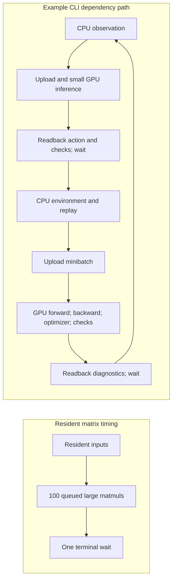

# Why CPU CLI training outpaces the GPU matrix benchmark

The [2026-10-05 performance measurements](gpu-performance.md) answer two different
questions: how fast a resident square matrix product runs, and how fast a whole
CLI training process completes environment steps. A fast matrix kernel does not
guarantee fast training.

## Same GPU, different workload

On the tested RTX 5060 Laptop GPU, `GpuContext::new` selects the tiled matrix
kernel. CLI agents use this context too; they do not secretly fall back to a
different CPU matrix algorithm. See [context selection](../crates/rustforge-tensor/src/gpu.rs#L219).

| Property | Matrix microbenchmark | Default CLI training |
| --- | --- | --- |
| Work | Square FP32 products up to 1024 × 1024 | Forward passes, backward passes, optimizers, checks, environment and replay |
| Shape | Large products at the upper end | 64-unit hidden networks; action inference typically has batch 1, TD3/SAC update batch 64 |
| Inputs/outputs | Uploaded once; GPU output buffers reused | Observations and sampled CPU replay batches uploaded; actions and diagnostics read back |
| Operations | 100 queued products, one terminal completion wait inside each timed batch | Many small operations with dependent CPU/GPU work and readback waits |
| Timed boundary | Submission and completion; excludes transfers and initialization | Fresh process, initialization, training, metrics and shutdown |

A 1024-square product performs approximately `2 × 1024³ = 2.15 billion`
floating-point operations. A batch-one `1 × 4` by `4 × 64` input projection
performs about 512. A `64 × 64` by `64 × 64` minibatch projection performs about
524,288. These are illustrative operation counts, not measured whole-network
costs. Large products offer much more work over which to amortize each launch.

The same recorded matrix dataset already shows this crossover: tiled GPU is
slower than CPU at 32, 64 and 128 square dimensions, becomes faster at 256, and
reaches 12.74× at 1024. It does not establish a universal threshold for rectangular
network shapes.

## What the implementation actually does

1. **CPU environments impose a dependency loop.** TD3 selects an action, calls
   `env.step`, writes the next observation, samples CPU replay and trains before
   proceeding. CPU and GPU cannot freely execute those dependent steps in
   parallel. [Runtime loop](../crates/rustforge-rl/src/agent/td3_runtime.rs#L192).
2. **Small tensor operations each submit work.** The shared GPU operation path
   creates a parameter buffer, bind group and command encoder for an operation,
   then calls `queue.submit`. Computation can chain without a CPU wait, but it is
   not one fused forward/backward/optimizer kernel.
   [Operation submission](../crates/rustforge-tensor/src/gpu/operations.rs#L518).
3. **Readback waits for completion.** `readback_values` allocates a staging buffer,
   copies device data, maps it, and calls `device.poll(Maintain::Wait)` before
   returning. Even a scalar diagnostic can therefore stop the host until queued
   work completes. [Readback](../crates/rustforge-tensor/src/gpu.rs#L379).
4. **Readbacks occur during training, not just after it.** TD3 uploads a batch-one
   observation and returns an action to the CPU. Its checked forward passes,
   losses, gradients and updated parameters also perform validity checks; the
   nonfinite-count check reads a scalar back. PPO similarly downloads action
   log probabilities and a value during sampling, and several scalars for loss
   metrics. [TD3 inference](../crates/rustforge-rl/src/agent/gpu_td3/agent.rs#L199),
   [TD3 updates](../crates/rustforge-rl/src/agent/gpu_td3/agent.rs#L346),
   [TD3 validation](../crates/rustforge-rl/src/agent/gpu_td3.rs#L116),
   [PPO sampling](../crates/rustforge-rl/src/agent/gpu_ppo/agent.rs#L203).
5. **TD3/SAC perform substantial work per environment step.** Their defaults begin
   replay learning at step 64 and then update every step, even while random action
   collection continues to step 1,000. TD3 has two critics, actor updates, target
   updates and transactional parameter/optimizer staging. These are many more
   operations than one matrix product.
   [Replay/update loop](../crates/rustforge-rl/src/agent/td3_runtime.rs#L241),
   [staged updates](../crates/rustforge-rl/src/agent/gpu_td3/agent.rs#L346).

The 10-episode Pendulum medians were 0.198/64.030 seconds for CPU/GPU PPO,
0.743/210.578 for TD3, and 1.482/433.433 for SAC, each completing 2,000 steps.
Startup is included, but the source also exposes recurring transfers, submissions
and waits throughout training. No profiler apportioned their costs, so these
measurements do **not** establish which individual mechanism dominates or any
percentage breakdown. They do establish that this default implementation and
workload do not benefit from GPU end-to-end execution.

## Softmax precision fix

The original `log_softmax` used `(x - maximum) - log(total)`. With large common
logit offsets, the observed GPU result lost the small normalization difference.
For `[0, -0.75, -1.5]` shifted by -10,000, the old result was `-0.5283203` instead
of about `-0.52797574`. This matches FP32 rounding of a reassociated
`x - (maximum + log(total))`; the precise driver compilation stage was not traced.
[WGSL permits floating-point reassociation](https://www.w3.org/TR/WGSL/#reassociation-and-fusion).

The correction explicitly computes `shifted = fma(-1.0, maximum, x)` before
subtracting `log(total)`. It adds no GPU dispatch or host transfer. It fixes the
observed backend behavior without relaxing tolerances. A regression checks both
log probabilities and probabilities under offsets -10,000, -1,000, 0, 1,000 and
10,000 against an f64 oracle. The original 23 GPU tensor tests plus this regression
pass, and the PPO/A2C/REINFORCE loss suites pass 11 tests.

WGSL does not promise a universally correctly rounded fused operation for `fma`;
these are verified results for the tested RTX/Vulkan backend, not proof for every
driver. [WGSL fma contract](https://www.w3.org/TR/WGSL/#fma-builtin).

The original timings and binary hashes are retained as **pre-fix measurements**.
The 42-process performance suite was not rerun after this correctness change,
and the fix is not a claimed CLI speed optimization. A post-fix validation record
is linked from the [performance report](gpu-performance.md).

## Where performance work should start

Profile kernel submissions, readback waits, copies and allocations separately
before choosing an optimization. Likely candidates are batching independent
environments, keeping replay/minibatches resident, reusing buffers, fusing small
operations and batching diagnostic readbacks. Any change to checks must preserve
nonfinite detection and transactional update guarantees; deleting validation to
improve a timing number would change the behavior being compared. Larger batches
or networks are worth measuring, but no speedup for them is established here.
