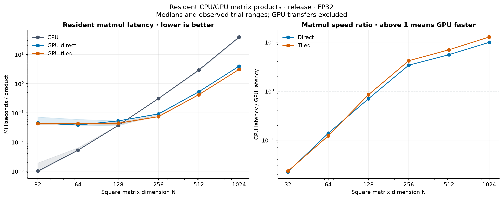
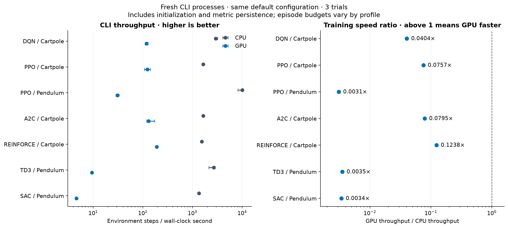

# GPU performance benchmark

Measured on **2026-10-05** from source commit `9fc2582a2041`.

The tiled matmul kernel's best measured CPU/GPU latency ratio is **12.74× at 1024×1024**. GPU CLI throughput is lower than CPU in 7 of 7 measured profiles. These are separate workloads: fast resident matrix products do not establish fast end-to-end RL training.

**Follow-up correctness fix:** the softmax precision regression is fixed in the current working tree. The GPU tensor suite passes 24/24 tests and related policy loss suites pass 11/11. The performance tables above remain pre-fix measurements; the 42-process timing suite was not rerun.

For the implementation paths and timing differences, see [why CLI training differs from a matrix benchmark](gpu-cli-performance.md).

## Environment and artifacts

- CPU: AMD Ryzen 7 250 w/ Radeon 780M Graphics
- GPU and driver:

```text
name, driver_version, memory.total [MiB]
NVIDIA GeForce RTX 5060 Laptop GPU, 616.92, 8151 MiB
```

- Selected matmul adapter:

```text
AdapterInfo { name: "NVIDIA GeForce RTX 5060 Laptop GPU", vendor: 4318, device: 11609, device_type: DiscreteGpu, driver: "NVIDIA", driver_info: "616.92", backend: Vulkan }
```

- OS: `Windows-11-10.0.26200-SP0`; `rustc 1.96.0 (ac68faa20 2026-05-25)`; release build with `gpu` and locked dependencies.
- [Run metadata](../benchmarks/gpu_comparison/results/2026-10-05/metadata.json), [matmul CSV](../benchmarks/gpu_comparison/results/2026-10-05/matmul.csv), [training samples](../benchmarks/gpu_comparison/results/2026-10-05/training.json).
- The matrix harness adds an optional size list; [the exact measured source patch](../benchmarks/gpu_comparison/results/2026-10-05/source-diff.patch) is saved with binary hashes.
- One laptop session; clock, power and thermal conditions were not locked. Three trials show observed spread, not confidence intervals.

## Resident matrix multiplication



[Vector SVG](../benchmarks/gpu_comparison/results/2026-10-05/figures/matmul-comparison.svg)

Each size uses deterministic inputs (seeds 123/124), three warmup dispatches per GPU kernel, three trials and 100 products per trial. GPU order alternates. Timings include submission, dispatch parameter allocation and completion; upload, download and pipeline initialization are excluded. GPU output buffers are reused; CPU output allocation is included. After each trial, each GPU kernel's final output is checked against the CPU result using `1e-4 + 1e-4 * abs(expected)` tolerance, outside timing.

Median milliseconds per product; brackets show the observed minimum–maximum:

| N × N | CPU ms | GPU direct ms | GPU tiled ms | CPU / tiled |
| --- | ---: | ---: | ---: | ---: |
| 32 × 32 | 0.0010 [0.0009–0.0019] | 0.0447 [0.0390–0.0715] | 0.0432 [0.0406–0.0433] | 0.02× |
| 64 × 64 | 0.0052 [0.0052–0.0063] | 0.0380 [0.0377–0.0596] | 0.0429 [0.0411–0.0430] | 0.12× |
| 128 × 128 | 0.0370 [0.0369–0.0373] | 0.0530 [0.0358–0.0530] | 0.0438 [0.0397–0.0476] | 0.85× |
| 256 × 256 | 0.3087 [0.3039–0.3241] | 0.0913 [0.0872–0.0956] | 0.0740 [0.0732–0.0807] | 4.17× |
| 512 × 512 | 2.9155 [2.7534–2.9487] | 0.5258 [0.5219–0.5323] | 0.4176 [0.4105–0.4203] | 6.98× |
| 1024 × 1024 | 38.9989 [36.9943–39.5512] | 3.9379 [3.9379–3.9430] | 3.0606 [3.0541–3.0725] | 12.74× |

A ratio above 1 means GPU is faster. This measures square FP32 products, not arbitrary network shapes or transfer-inclusive latency. The previous [llvmpipe measurements](gpu-development.md#performance-evidence) remain a separate historical dataset from a different machine.

## End-to-end CLI training



[Vector SVG](../benchmarks/gpu_comparison/results/2026-10-05/figures/training-comparison.svg)

All six algorithms are covered, including both PPO environment routes. Each trial launches a fresh release CLI process; CPU/GPU order alternates. Wall time includes process startup, GPU adapter/pipeline initialization, training, metrics writes and shutdown. No checkpoint is saved and no TUI is run. Actual completed steps are divided by process wall time. Medians aggregate per-trial rates, not ratios of pooled totals.

| Algorithm / environment | Episodes | CPU steps/s | GPU steps/s | GPU / CPU |
| --- | ---: | ---: | ---: | ---: |
| DQN / cartpole | 30 | 2,936.1 | 118.6 | 0.0404× |
| PPO / cartpole | 10 | 1,637.5 | 124.0 | 0.0757× |
| PPO / pendulum | 10 | 10,086.8 | 31.2 | 0.0031× |
| A2C / cartpole | 10 | 1,643.7 | 130.7 | 0.0795× |
| REINFORCE / cartpole | 10 | 1,537.9 | 190.3 | 0.1238× |
| TD3 / pendulum | 10 | 2,690.4 | 9.5 | 0.0035× |
| SAC / pendulum | 10 | 1,349.9 | 4.6 | 0.0034× |

Completed steps and total wall time, both medians:

| Algorithm / environment | CPU steps | GPU steps | CPU seconds | GPU seconds |
| --- | ---: | ---: | ---: | ---: |
| DQN / cartpole | 598 | 598 | 0.203 | 5.375 |
| PPO / cartpole | 306 | 306 | 0.187 | 2.468 |
| PPO / pendulum | 2,000 | 2,000 | 0.198 | 64.030 |
| A2C / cartpole | 306 | 306 | 0.186 | 2.340 |
| REINFORCE / cartpole | 285 | 285 | 0.185 | 1.497 |
| TD3 / pendulum | 2,000 | 2,000 | 0.743 | 210.578 |
| SAC / pendulum | 2,000 | 2,000 | 1.482 | 433.433 |

### Interpretation and limits

- Default networks use 64 hidden units. TD3/SAC use batch 64, learn from step 64 and use random actions for the first 1,000 steps; all their runs complete 2,000 steps. The 30-episode DQN budget is checked for a nonzero recorded training loss. Metrics must be finite, except DQN's documented no-update NaN loss before training starts; step counters must increase.
- CLI training is episode-budgeted. CartPole policies can finish different numbers of steps, so raw total seconds are not equal-work comparisons. Throughput normalizes actual steps, but different trajectories still produce different update workloads.
- The CLI supplies seed 2026 to the on-policy and continuous trainers; DQN has no CLI seed parameter. Three trials repeat the CLI defaults rather than sampling three independent learning seeds. Cross-backend numerical trajectories need not match.
- These short runs do not establish convergence, reward superiority, checkpoint recovery, device-loss robustness, or full GPU correctness. Kernel dispatch, synchronization, readback and startup are plausible overheads; no profiler was run to apportion their cost.
- The historical [RustForge vs SB3 CPU benchmark](performance.md#historical-cpu-dqn-benchmark) was not rerun. It uses a different workload and timing boundary and must not be combined with this dataset to claim a GPU-vs-SB3 speedup.

## Reproduce

From the workspace root:

```bash
cargo build --release --locked -p rustforge-cli --features gpu --bin rustforge
cargo build --release --locked -p rustforge-tensor --features gpu --example gpu_benchmark
python benchmarks/gpu_comparison/run.py --output benchmarks/gpu_comparison/results/NEW-RUN --trials 3 --iterations 100
python benchmarks/gpu_comparison/plot.py benchmarks/gpu_comparison/results/NEW-RUN
```

Use the standalone Python environment described in [the benchmark guide](../benchmarks/gpu_comparison/README.md). The collector refuses to overwrite an existing run directory. Plots require Matplotlib; collection uses only Python's standard library.


## Verification history

[Verification record](../benchmarks/gpu_comparison/results/2026-10-05/validation.json). This is separate from the successful performance run.

| Check | Result |
| --- | --- |
| `cargo fmt --all -- --check` | PASS |
| `cargo clippy --locked -p rustforge-tensor --features gpu --example gpu_benchmark -- -D warnings` | PASS |
| `python benchmarks/gpu_comparison/test_metrics.py` | PASS: 7 tests |
| `cargo test --locked -p rustforge-tensor --features gpu --test gpu_matmul -- --include-ignored --test-threads=1` | FAIL: 22 passed, 1 failed, 0 ignored |
| `cargo test --locked -p rustforge-tensor --features gpu --test gpu_matmul stable_categorical_probabilities_cover_extreme_logits_empty_rows_and_exp -- --exact --ignored --test-threads=1` | FAIL: same assertion reproduced in isolation |

**Original pre-fix numerical failure:** `stable_categorical_probabilities_cover_extreme_logits_empty_rows_and_exp` failed at [crates/rustforge-tensor/tests/gpu_matmul.rs:619](../crates/rustforge-tensor/tests/gpu_matmul.rs#L619). Actual probability `0.58981043` vs reference `0.5897977` differs by `1.27e-05`, exceeding tolerance `2e-06`. The isolated pre-fix rerun failed identically. These records describe the original benchmark snapshot, and are retained without overwriting the measured binary hashes or timing samples.


### Softmax fix validation

[Post-fix record](../benchmarks/gpu_comparison/results/2026-10-05/softmax-fix-validation.json). See [the diagnosis and implementation explanation](gpu-cli-performance.md#softmax-precision-fix).

| Check | Result |
| --- | --- |
| `cargo test --locked -p rustforge-tensor --features gpu --test gpu_matmul categorical_probabilities_preserve_common_logit_offsets -- --exact --ignored --test-threads=1` | PRE-FIX: expected failure, log probability -0.5283203 vs -0.52797574 |
| `cargo test --locked -p rustforge-tensor --features gpu --test gpu_matmul -- --include-ignored --test-threads=1` | POST-FIX PASS: 24 tests, 0 ignored |
| `cargo test --locked -p rustforge-rl --features gpu --test gpu_ppo_loss --test gpu_a2c_loss --test gpu_reinforce_loss -- --include-ignored --test-threads=1` | POST-FIX PASS: PPO 3, A2C 4, REINFORCE 4; 11 total |
| `cargo fmt --all -- --check` | PASS |
| `cargo clippy --locked -p rustforge-tensor --features gpu --all-targets -- -D warnings` | PASS |
| `cargo build --release --locked -p rustforge-cli --features gpu --bin rustforge` | PASS |
| `rustforge train ppo --device gpu --env cartpole --episodes 2 --output <new smoke-test file>` | PASS: 2 episodes, 51 steps; smoke check, not a new performance measurement |